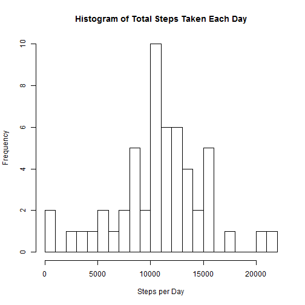
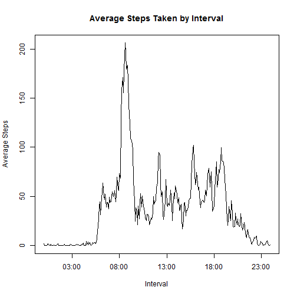

This is my Repoduceable Reserach course project #1 submission. 


## 1. Loading and preprocessing the data
The following analysis assumes that the 
[Activity Monitoring Data](https://d396qusza40orc.cloudfront.net/repdata%2Fdata%2Factivity.zip) 
have been downloaded and the "activity.csv" file extracted into the working 
directory. The following code reads the activity.csv data into r and displays a 
summary.

```r
act <- read.csv(unzip("activity.zip"))
summary(act)
```

```
##      steps                date          interval     
##  Min.   :  0.00   2012-10-01:  288   Min.   :   0.0  
##  1st Qu.:  0.00   2012-10-02:  288   1st Qu.: 588.8  
##  Median :  0.00   2012-10-03:  288   Median :1177.5  
##  Mean   : 37.38   2012-10-04:  288   Mean   :1177.5  
##  3rd Qu.: 12.00   2012-10-05:  288   3rd Qu.:1766.2  
##  Max.   :806.00   2012-10-06:  288   Max.   :2355.0  
##  NA's   :2304     (Other)   :15840
```

Note that the interval start times are given as military time in integers so 
interval 835 converts to 8:35am and interval 1455 converts to 2:55pm.


## 2. What is the mean number of steps taken per day?

The mean number of steps taken each day can be caluclated by aggregating the 
sum of the steps variable on the date and then taking the mean of the resulting
data frame steps variable. The following code calculates the mean and median 
steps per day, and also generates a histogram of total steps per day.


```r
spd <- aggregate(steps~date, act, FUN = sum)
spdmean <- as.integer(mean(spd$steps))
spdmedian <- as.integer(median(spd$steps))
spdhist <-hist(as.numeric(spd$steps), breaks = 20, xlab = "Steps per Day", 
     main = "Histogram of Total Steps Taken Each Day")
```

 

The mean steps taken each day are: 10766.

The median steps taken each day are: 10765.


## 3. What is the average daily activity pattern?

The average daily activity pattern can be seen by graphing the average steps 
taken per interval across all days. The following code aggregates the steps 
variable by interval, graphs the average steps by interval and determines which 
interval has the highest average number of steps taken.


```r
spi <- aggregate(steps~interval, act, FUN = mean)
plot(spi$interval, spi$steps, type ="l", ylab = "Average Steps", 
     xlab = "Interval", main = "Average Steps Taken by Interval")
```

 

```r
spimax <- spi[spi$steps == max(spi$steps), 1]
```
The 5 minute interval with the highest average number of steps is identified as: 
835.


## 4. Imputing missing values

The activity.csv file has missing data in the steps variable, the following code
counts the number of missing vlaues.

```r
natestraw <- sum(as.numeric(is.na(act$steps)))
```

There are 2304 rows with NA values for the steps variable in the 
original "activity.csv" data.

I will impute these NA values by replacing each NA value with the average number 
of steps taken in the respective interval. The following code subsets the 
observations with NA values, merges the mean step values generated in the 
previous by interval, and replaces the NA values with the interval step mean 
values. The data frame is cleaned-up and recombined with a subset of non-NA 
values. A summary of the full data without NAs is provided and the number of 
remaining NA values is recounted.


```r
## seperate NA values into a new data set and merge with a renamed spi (generated above)
actnodata <- act[is.na(act$steps), ]
spii <- spi
names(spii) <- c("interval", "stepsti")
actimpu <- merge(x = actnodata, y = spii, by = "interval")
actimpu$steps <- actimpu$stepsti
actimpu <- actimpu[ , 1:3]

## gather all non NA observations and reconbine with the imputed data 
actdata <- act[!is.na(act$steps), ]
actidata <- rbind(actdata, actimpu)

## confirm that there are no remaining NA values present summary
natestimp <- sum(as.numeric(is.na(actidata$steps)))
summary(actidata)
```

```
##      steps                date          interval     
##  Min.   :  0.00   2012-10-01:  288   Min.   :   0.0  
##  1st Qu.:  0.00   2012-10-02:  288   1st Qu.: 588.8  
##  Median :  0.00   2012-10-03:  288   Median :1177.5  
##  Mean   : 37.38   2012-10-04:  288   Mean   :1177.5  
##  3rd Qu.: 27.00   2012-10-05:  288   3rd Qu.:1766.2  
##  Max.   :806.00   2012-10-06:  288   Max.   :2355.0  
##                   (Other)   :15840
```

After replacing the NA values with interval means there are 0 rows 
with NA values in the steps variable.

To see if replacing the NA values has had a difference I calculate the same 
mean, median and histogram of steps per day as in the second step. The following
performs the same steps.


```r
spdi <- aggregate(steps~date, actidata, FUN = sum)
spdmeani <- as.integer(mean(spdi$steps))
spdmediani <- as.integer(median(spdi$steps))
spdhisti <-hist(as.numeric(spdi$steps), breaks = 20, xlab = "Steps per Day", 
     main = "Histogram of Steps Taken per Day After NA Values Replaced")
```

 

After the NA values were replaced the mean steps taken per day are: 10766.

After the NA values were replaced the median steps taken per day are: 10766. 

These values are almost exactly the same as the mean and median values with NA 
values presented above. Given that the NA values arrise from entire missing days 
of data and I used the intervalmean to replace the NA values we should not 
expect to see a the mean change. Similarly the median is now equal to the mean 
because I esentially added 8 daysof data with step counts equal to the mean.


## 5. Are there differences in activty patterns between weekdays and weekends?

The activity pattern varries between weekdays and weekends; to see how much we 
can look at a plot similar to the one developed in step 3 but seperate the 
weekday from weekend values. The following code tags each observation as 
ocurring on a weekday or weekend, aggregates the step observations on the 
interval and daytype factor, and then plots each activity pattern. The plot 
is constructed in lattice so the lattice package must be installed prior to 
creating this plot.


```r
## create weekday vs. weekend factor and aggregate steps by interval and daytype
weekday <- c("Monday", "Tuesday", "Wednesday", "Thursday", "Friday")
weekend <- c("Saturday", "Sunday")
actidata$daytype <- as.factor(weekdays(as.Date(act$date, format = "%Y-%m-%d")))
levels(actidata$daytype) <- list(weekend = weekend, weekday = weekday)
wdvswe <- aggregate(steps~interval + daytype, actidata, FUN = mean)

## create plot in lattice
library(lattice)
xyplot(steps~interval|daytype, data=wdvswe, type="l", layout=(c(1,2)), 
       ylab="Average Steps", xlab="Five Minute Interval", 
       main="Average Steps by Interval: Weekday vs. Weekend")
```

 
